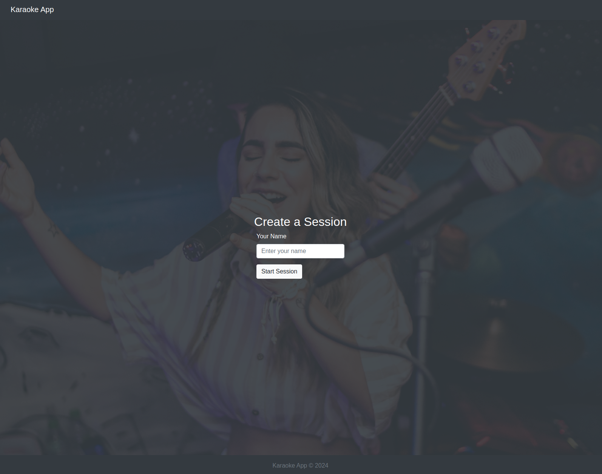
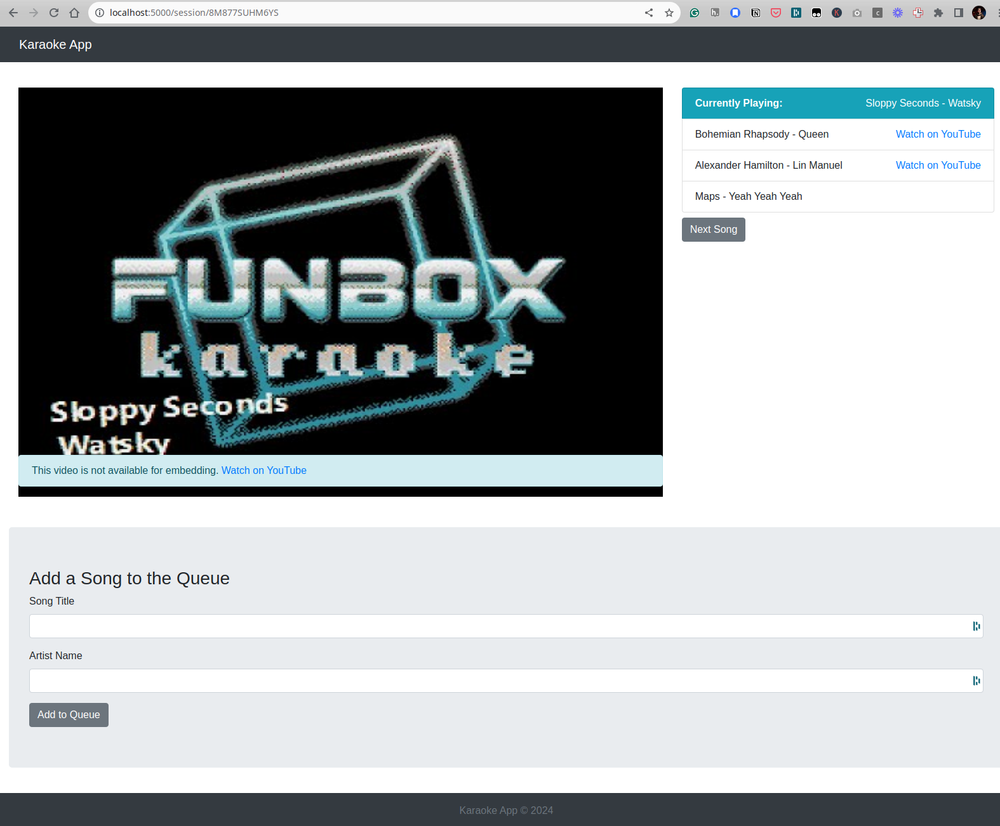

# Karaoke Queue Management System

The Karaoke Queue Management System is a fun, interactive application allowing users to better manage their home karaoke parties. This application integrates with the YouTube API to fetch karaoke videos, and then manages these videos in an interactive queue.

# Features

- Song search via YouTube API
- Session management for group karaoke experiences
- Queue system for song lineup
- User accounts for tracking song and session history (TODO)
- Lists for managing favorite songs (TODO)
- Multi-user integration for shared sessions (TODO)

# Getting Started

These instructions will get you a copy of the project up and running on your local machine for development and testing purposes. The code examples below assume your are running Ubuntu, but any OS can be used.

## Prerequisites

Before you begin, ensure you have the following installed on your computer:

- [Git](https://git-scm.com/book/en/v2/Getting-Started-Installing-Git)
- [Docker](https://docs.docker.com/get-docker/)
- [Docker Compose](https://www.digitalocean.com/community/tutorial-collections/how-to-install-docker-compose)

Knowledge in the following technologies will be beneficial:

- Flask (Python web framework)
- MySQL
- JavaScript, HTML, and CSS

## Installation

### 1. Clone the Repository

Clone the project repository to your local machine using Git:

```
git clone https://github.com/tristenwallace/karaoke-queue-management.git
cd karaoke-queue-management
```

### 2. Configure Environment Variables

Before running the application, you need to set up the necessary environment variables. These variables are crucial for configuring the database connection, setting up the Flask application environment, and integrating external APIs.

Create a .env file in the root directory of your project. This file will store your environment variables. Here's a template to get you started:

```
FLASK_APP=app.py
FLASK_ENV=development  # Use 'production' for production environments
DATABASE_HOST=db
MYSQL_DATABASE=your_database_name
MYSQL_USER=your_database_user
MYSQL_PASSWORD=your_database_password
MYSQL_ROOT_PASSWORD=your_root_password
FLASK_SECRET_KEY=your_secret_key_here  # Generate a strong secret key for session management
YOUTUBE_API_KEY=youtube_api_key
```

Explanation of Variables:
- FLASK_APP: Specifies the entry file of your Flask application.
- FLASK_ENV: Sets the environment for the Flask app. Use development for development purposes and production for deploying your application.
- DATABASE_HOST: The hostname of your MySQL database server, often localhost for local development (we're using 'db' in docker-compose.yml).
- MYSQL_DATABASE: The name of the MySQL database you are connecting to.
- MYSQL_USER: Your MySQL database username.
- MYSQL_PASSWORD: The password for your MySQL database user.
- MYSQL_ROOT_PASSWORD: The password for your MySQL root user.
- FLASK_SECRET_KEY: A secret key used by Flask for securely signing the session cookie. Use a strong random value here.
- YOUTUBE_API_KEY: (Optional) Required if you're integrating YouTube API features. Obtain this key from the [Google Cloud Console](https://console.cloud.google.com/) by creating a project and enabling the YouTube Data API v3.

### 3. Initialize the Database

After downloading the repo and add environment variables, you need to spin up the container and set up the MySQL database schema. You can seed it with initial data if necessary. Execute the following commands:

```
# Spin up the container
docker-composer up -d

# Confirm the container is running
docker-compose ps

# Run database migrations
docker-compose exec web flask db upgrade

# Seed the database (optional)
docker-compose exec web flask seed-db
```

These commands will create the necessary tables and seed them with initial data for testing. If you haven't added your username to the docker group, you'll need to run these commands with sudo.

## Usage

With the application and database set up, you can start using the Karaoke Queue Management System. Here's how to interact with the system:

### Accessing the Application

After the containers are up and running, you can access the Flask application by running the following command from the root of the project directory:

```
docker-compose exec web flask run
```

Then navigate to `http://localhost:5000` in your web browser. The port number (5000) might be different if you've configured it otherwise in the Docker settings or .env file.


### Creating a Session

On the homepage, you can create a new karaoke session by entering your name and clicking the "Start Session" button. This action will generate a unique session in the karaoke database.



### Managing the Song Queue

Once in a session, participants can add songs to the queue, and the host can manage the queue by playing songs and reordering the queue. Many Karaoke channels on Youtube don't allow 
embedding of their videos, so at the moment the app simply provides a thumbnail and link for each video.



### Customization

Feel free to customize the application to fit your needs better. You can modify the Flask application, HTML templates, and stylesheets located in the app directory.


## Acknowledgments

- YouTube Data API for providing song search capabilities
- Flask community for the extensive documentation and resources